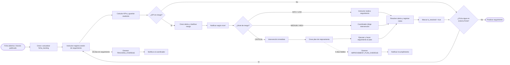

# Justificación del uso de BPMN en `monitoring-service`

## 1. Objetivo

Este documento explica por qué el microservicio `monitoring-service` requiere un modelo BPMN y describe la forma en que su proceso de seguimiento y gestión de alertas puede representarse en Camunda Modeler.

El análisis se centra en el proceso de negocio del servicio: activación del seguimiento, registro de sesiones, cálculo de indicadores, detección de riesgos, generación de alertas, intervención de los responsables, control de tiempos y cierre de las alertas.

---

## 2. Conclusión

El microservicio `monitoring-service` **sí necesita un BPMN** porque no se limita a operaciones CRUD ni a una única llamada técnica. Coordina un proceso de negocio que:

- comienza por eventos provenientes de otros microservicios;
- permanece activo durante semanas o meses;
- combina actividades automáticas y actividades humanas;
- toma decisiones con base en KPIs y niveles de riesgo;
- utiliza temporizadores y fechas límite;
- envía notificaciones a distintos responsables;
- exige intervención y seguimiento;
- conserva evidencia de quién resolvió una alerta, cuándo se resolvió y qué observaciones se registraron.

BPMN es adecuado cuando existe un proceso con participantes, decisiones, eventos, tiempos, excepciones y responsabilidades claramente diferenciadas. Estas condiciones se cumplen en `monitoring-service`.

---

## 3. Problema de negocio que resuelve `monitoring-service`

El servicio supervisa el estado académico de una ficha mientras se encuentra en ejecución. Para cumplir esta responsabilidad debe:

1. iniciar el seguimiento cuando la ficha se abre o se publica su horario;
2. registrar sesiones periódicas de seguimiento;
3. calcular indicadores como asistencia y avance curricular;
4. comparar los resultados con los umbrales configurados;
5. detectar situaciones de riesgo;
6. clasificar el riesgo como `INFO`, `LOW`, `MEDIUM`, `HIGH` o `CRITICAL`;
7. notificar al instructor, coordinador o director, según corresponda;
8. exigir una intervención de acuerdo con la gravedad del caso;
9. exigir un plan de mejoramiento cuando el nivel sea crítico;
10. controlar que el plan se cree dentro de cinco días hábiles;
11. resolver manualmente la alerta y dejar trazabilidad;
12. repetir el ciclo mientras la ficha continúe en estado `EXECUTION`.

Este comportamiento corresponde a un **proceso de larga duración**. No termina con una sola petición HTTP, ya que depende del paso del tiempo, de nuevas mediciones y de la intervención de varias personas.

---

## 4. Razones para utilizar BPMN

### 4.1. El proceso se activa mediante eventos externos

El seguimiento comienza cuando `monitoring-service` recibe eventos de otros servicios, principalmente:

- `academic.ficha.opened`;
- `scheduling.schedule.published`.

En BPMN este comportamiento puede representarse mediante un **evento de inicio por mensaje**. De esta forma queda claro que la activación del proceso no depende de una operación interna aislada, sino de una comunicación proveniente de otro participante.

### 4.2. Combina actividades automáticas y humanas

El sistema realiza automáticamente actividades como:

- crear o actualizar `ficha_tracking`;
- calcular KPIs;
- guardar cada medición;
- comparar los resultados con los umbrales;
- crear alertas;
- clasificar el nivel de riesgo;
- enviar notificaciones;
- marcar una alerta como resuelta.

Las personas realizan actividades como:

- registrar una sesión de seguimiento;
- analizar el caso detectado;
- coordinar una intervención;
- crear y ejecutar un plan de mejoramiento;
- resolver la alerta y registrar las observaciones.

BPMN permite diferenciar estas responsabilidades mediante:

- **tareas de servicio**, para actividades automáticas;
- **tareas de usuario**, para actividades realizadas por una persona;
- **carriles**, para indicar qué participante es responsable de cada tarea.

### 4.3. Contiene decisiones de negocio

No todas las fichas siguen el mismo camino. El proceso debe evaluar preguntas como:

- ¿el KPI se encuentra dentro del rango esperado?;
- ¿existe una condición de riesgo?;
- ¿el nivel es `INFO/LOW`, `MEDIUM/HIGH` o `CRITICAL`?;
- ¿la ficha continúa en estado `EXECUTION`?

Estas decisiones se representan mediante **compuertas exclusivas**, porque el flujo toma una sola ruta según el resultado de la condición evaluada.

### 4.4. Incluye tiempos límite

El proceso contiene dos reglas temporales importantes:

- si no se registra seguimiento durante más de **35 días**, se genera la alerta `TRACKING_OVERDUE`;
- si una ficha crítica no tiene un plan de mejoramiento dentro de **5 días hábiles**, se genera `IMPROVEMENT_PLAN_OVERDUE`.

BPMN permite representar estas reglas con **eventos de temporizador asociados a una tarea**. En el modelo se utilizan temporizadores no interruptivos: la alerta de vencimiento se genera, pero la tarea humana original permanece disponible para ser completada.

### 4.5. Aplica escalamiento según la gravedad

La acción requerida cambia según el nivel de riesgo:

| Nivel | Tratamiento dentro del proceso |
|---|---|
| `INFO` / `LOW` | El instructor revisa el caso y realiza seguimiento. |
| `MEDIUM` / `HIGH` | El coordinador dirige la intervención; en nivel alto se requiere una actuación prioritaria. |
| `CRITICAL` | Se realiza una intervención inmediata y se crea un plan de mejoramiento. |

BPMN muestra de forma explícita cómo cambia el responsable y qué actividades deben ejecutarse en cada caso.

### 4.6. Requiere trazabilidad

Las alertas no deben eliminarse al finalizar su atención. El servicio debe conservar, como mínimo:

- el usuario que resolvió la alerta;
- la fecha y hora de resolución;
- las notas registradas;
- la relación con el KPI y la ficha;
- la relación con el plan de mejoramiento cuando corresponda.

El BPMN identifica el punto exacto en el que el coordinador o director resuelve la alerta y el sistema actualiza la información de resolución.

### 4.7. Es repetitivo y de larga duración

Después de atender una medición, el proceso verifica si la ficha sigue en `EXECUTION`:

- si continúa activa, se inicia un nuevo ciclo de seguimiento;
- si dejó de estar en ejecución, el proceso termina.

BPMN permite visualizar este ciclo y evita representar el seguimiento como una operación aislada.

---

## 5. Diferencia frente a un diagrama de secuencia

Un diagrama de secuencia resulta útil para explicar llamadas técnicas entre componentes, por ejemplo:

```text
evento -> alert-worker -> base de datos -> notification-worker
```

Sin embargo, un diagrama de secuencia no muestra con la misma claridad:

- quién es responsable de cada actividad humana;
- qué sucede después de 35 días sin seguimiento;
- cómo cambia el flujo según el nivel de riesgo;
- qué ocurre si el plan no se crea dentro del plazo;
- cómo se repite el seguimiento;
- cuándo termina el proceso;
- quién está autorizado para resolver una alerta.

Por esta razón, ambos diagramas pueden complementarse:

- **BPMN:** representa el proceso de negocio completo;
- **diagrama de secuencia o arquitectura:** representa llamadas, workers, REST, mensajería, reintentos y DLQ.

---

## 6. Alcance del BPMN

### 6.1. Elementos incluidos

El modelo incluye:

- activación del seguimiento;
- creación o actualización de `ficha_tracking`;
- registro periódico de una sesión;
- control de 35 días sin seguimiento;
- cálculo y almacenamiento de KPIs;
- clasificación del riesgo;
- generación y notificación de alertas;
- atención según el nivel de riesgo;
- intervención para casos críticos;
- creación y seguimiento del plan de mejoramiento;
- control del plazo del plan;
- resolución manual de la alerta;
- repetición del ciclo mientras la ficha siga activa.

### 6.2. Elementos no incluidos

El modelo no detalla:

- configuración del broker de mensajería;
- reintentos y DLQ;
- formularios completos de Camunda;
- autenticación y autorización;
- consultas del tablero de seguimiento;
- operaciones CRUD de catálogos;
- correlación técnica de todos los eventos;
- tratamiento detallado de fallos de infraestructura.

Estos aspectos pertenecen al diseño técnico y pueden documentarse mediante diagramas complementarios o configuraciones de ejecución.

---

## 7. Participantes y responsabilidades

### 7.1. Servicios externos

Los principales servicios externos son:

- `academic-management-service`;
- `scheduling-service`.

Estos servicios envían los eventos que activan o actualizan el seguimiento de la ficha.

### 7.2. `monitoring-service`

Ejecuta las tareas automáticas del proceso:

- administrar `ficha_tracking`;
- calcular y registrar KPIs;
- generar alertas;
- clasificar el riesgo;
- enviar notificaciones;
- registrar la resolución.

### 7.3. Instructor responsable

El instructor:

- registra la sesión de seguimiento;
- atiende los casos de riesgo `INFO` o `LOW`;
- registra observaciones y acciones de seguimiento.

### 7.4. Coordinador académico o director de centro

Estos roles:

- intervienen en los casos de mayor riesgo;
- coordinan las acciones para niveles `MEDIUM` y `HIGH`;
- atienden los casos `CRITICAL`;
- crean y supervisan el plan de mejoramiento;
- resuelven formalmente la alerta.

---

## 8. Descripción del proceso

### Paso 1. Activar el seguimiento

El proceso recibe un evento de ficha abierta o de horario publicado.

### Paso 2. Crear o actualizar el seguimiento

El sistema crea `ficha_tracking` si todavía no existe. La operación debe ser idempotente para evitar duplicados cuando se reciban eventos relacionados con la misma ficha.

### Paso 3. Registrar una sesión de seguimiento

El instructor registra la sesión periódica con datos de asistencia, avance curricular y observaciones.

Esta tarea tiene asociado un temporizador no interruptivo de 35 días.

### Paso 4. Controlar los 35 días sin seguimiento

Si transcurren 35 días sin completar la sesión:

1. el sistema genera `TRACKING_OVERDUE`;
2. notifica al coordinador;
3. conserva abierta la tarea de registrar el seguimiento.

### Paso 5. Calcular y guardar KPIs

Cuando se registra la sesión, el sistema calcula los indicadores y agrega una nueva medición en `kpi_tracking`.

La medición es **append-only**: se inserta un nuevo registro y se conserva el histórico anterior.

### Paso 6. Determinar si existe riesgo

- Si el KPI está `ON_TRACK`, no se crea una alerta y el ciclo puede continuar.
- Si está `AT_RISK` o `CRITICAL`, el sistema crea una alerta.

### Paso 7. Crear y clasificar la alerta

El servicio registra `generated_alert`, actualiza el estado consolidado de la ficha y determina el nivel correspondiente:

- `INFO`;
- `LOW`;
- `MEDIUM`;
- `HIGH`;
- `CRITICAL`.

### Paso 8. Enviar la notificación

El servicio notifica a los responsables mediante los canales definidos, inicialmente:

- correo electrónico;
- notificación dentro de la aplicación.

### Paso 9. Ejecutar la acción correspondiente

- `INFO` / `LOW`: el instructor realiza el seguimiento.
- `MEDIUM` / `HIGH`: el coordinador dirige la intervención.
- `CRITICAL`: se ejecuta una intervención inmediata.

### Paso 10. Crear el plan de mejoramiento

Para un nivel `CRITICAL`, el coordinador crea el plan de mejoramiento y realiza su seguimiento.

La tarea tiene un temporizador no interruptivo de cinco días hábiles.

### Paso 11. Controlar el plazo del plan

Si el plan no se crea dentro del plazo:

1. el sistema genera `IMPROVEMENT_PLAN_OVERDUE`;
2. notifica el incumplimiento;
3. conserva disponible la tarea de crear el plan.

En el archivo BPMN el plazo se representa con `P5D`. Para una implementación productiva se debe aplicar un calendario laboral que excluya días no hábiles según las reglas de la organización.

### Paso 12. Resolver manualmente la alerta

El coordinador o director registra:

- responsable de la resolución;
- fecha y hora;
- notas de resolución.

### Paso 13. Actualizar el estado de la alerta

El sistema registra los datos de cierre:

```text
is_resolved = true
resolved_by = usuario
resolved_at = fecha y hora
resolution_notes = observaciones
```

La alerta se conserva como parte de la trazabilidad del proceso.

### Paso 14. Continuar o finalizar

- Si la ficha continúa en `EXECUTION`, el proceso vuelve a esperar el siguiente seguimiento.
- Si la ficha ya no se encuentra en ejecución, el seguimiento termina.

---

## 9. Reglas de negocio representadas

| Regla | Representación en BPMN |
|---|---|
| El seguimiento inicia por un evento externo. | Evento de inicio por mensaje. |
| El instructor registra las sesiones. | Tarea de usuario en el carril del instructor. |
| Más de 35 días sin seguimiento genera una alerta. | Temporizador de borde no interruptivo. |
| Un KPI normal no genera alerta. | Ruta “No” en la compuerta de riesgo. |
| Un KPI en riesgo genera y clasifica una alerta. | Tarea de servicio y compuerta por nivel. |
| La intervención cambia según la gravedad. | Tres rutas: `INFO/LOW`, `MEDIUM/HIGH` y `CRITICAL`. |
| Un nivel crítico exige plan de mejoramiento. | Tarea de usuario para crear el plan. |
| El plan crítico tiene un plazo de cinco días hábiles. | Temporizador de borde asociado a la creación del plan. |
| La alerta se resuelve con responsable, fecha y notas. | Tarea de usuario seguida de una tarea de servicio. |
| El proceso continúa mientras la ficha esté en ejecución. | Compuerta exclusiva y flujo de retorno. |

---

## 10. Elementos BPMN utilizados

| Elemento | Uso en el modelo |
|---|---|
| Pool externo | Representa los servicios que envían los eventos de activación. |
| Pool principal | Contiene el proceso de seguimiento y gestión de alertas. |
| Carriles | Separan las responsabilidades del sistema, instructor y coordinación/dirección. |
| Evento de mensaje | Inicia el seguimiento por un evento externo. |
| Tarea de servicio | Representa cálculos, registros, generación de alertas y notificaciones. |
| Tarea de usuario | Representa seguimiento, intervención, planes y resolución. |
| Compuerta exclusiva | Selecciona una ruta según el resultado de una condición. |
| Temporizador de borde | Detecta vencimientos sin cerrar la tarea principal. |
| Evento de fin | Finaliza una rama de aviso o el seguimiento completo. |

---

## 11. Representación resumida



---

## 12. Modelo en Camunda

El archivo `monitoring-service-seguimiento-alertas.bpmn` es compatible con Camunda Modeler y contiene:

- un evento de inicio por mensaje;
- tres carriles de responsabilidad;
- tareas de servicio y tareas de usuario;
- compuertas exclusivas;
- temporizadores de 35 días y 5 días;
- rutas de atención según el nivel de riesgo;
- un ciclo de seguimiento mientras la ficha permanezca en `EXECUTION`.

El proceso está definido como:

```text
isExecutable = false
```

Esta configuración indica que el archivo describe el proceso y puede abrirse, revisarse y validarse en Camunda Modeler. Para ejecutarlo en un motor de procesos se deben completar las configuraciones técnicas correspondientes.

---

## 13. Requisitos para una implementación ejecutable

Para convertir el modelo en un proceso ejecutable en Camunda 8 se deben agregar, como mínimo:

- `job type` para cada tarea automática;
- workers para los cálculos, escrituras y notificaciones;
- formularios para las tareas humanas;
- grupos candidatos para instructor, coordinador y director;
- variables de proceso;
- correlación de mensajes mediante `fichaId`;
- idempotencia mediante `eventId`;
- política de reintentos;
- manejo de incidentes y DLQ;
- calendario de días hábiles para el plazo del plan.

### Variables mínimas sugeridas

| Variable | Ejemplo | Uso |
|---|---|---|
| `fichaId` | UUID | Correlacionar el seguimiento. |
| `fichaStatus` | `EXECUTION` | Determinar si el ciclo continúa. |
| `kpiStatus` | `ON_TRACK`, `AT_RISK`, `CRITICAL` | Determinar si se genera una alerta. |
| `riskLevel` | `INFO` a `CRITICAL` | Seleccionar el tipo de intervención. |
| `alertId` | UUID | Relacionar las tareas y la resolución. |
| `trackingId` | UUID | Identificar `ficha_tracking`. |
| `improvementPlanId` | UUID | Relacionar el plan de mejoramiento. |
| `responsibleUserId` | UUID | Registrar quién atiende o resuelve. |

---

## 14. Criterios de simplificación

Para mantener legible el proceso, algunas actividades técnicas se agrupan:

- “Crear alerta y clasificar riesgo” representa la escritura en `generated_alert`, la actualización del estado y la selección del nivel.
- “Notificar según el nivel” representa las actividades del `notification-worker`.
- “Calcular KPIs y guardar medición” representa el cálculo y la inserción append-only en `kpi_tracking`.
- Los reintentos, la DLQ y los fallos del proveedor de correo no se representan en el flujo principal.
- El cierre por `academic.ficha.closed` se representa mediante la decisión “¿Ficha continúa en EXECUTION?”. Una versión ejecutable puede incorporar un evento de mensaje interruptivo.

---

## 15. Aspectos de consistencia que deben definirse

### 15.1. Nombre del evento de alerta

La documentación utiliza dos nombres:

- `monitoring.alert.generated`;
- `monitoring.alert.triggered`.

Se debe establecer un único nombre canónico para evitar diferencias entre contratos, consumidores y publicaciones.

### 15.2. Componente responsable del cálculo y de la alerta

La responsabilidad aparece distribuida entre `monitoring-api` y `alert-worker` según el documento consultado.

El BPMN asigna la actividad al participante general `monitoring-service`. En el diseño técnico debe definirse qué componente calcula el KPI, crea `generated_alert` y publica el evento correspondiente.

### 15.3. Evento periódico de KPI

El contrato del worker menciona `monitoring.kpi.tick`, pero su generación y frecuencia deben quedar definidas antes de una implementación ejecutable.

---

## 16. Fuentes del proyecto

- `09-microservices/services/08-monitoring-service/README.md`, líneas 10-16, 23-34, 40-58 y 69-77.
- `02-domain/entities-and-rules.md`, líneas 198-234.
- `04-requirements/functional.md`, líneas 82-90.
- `04-requirements/user-stories.md`, líneas 98-123.
- `09-microservices/services/08-monitoring-service/components/monitoring-api/contract.md`, líneas 61-149.
- `09-microservices/services/08-monitoring-service/data-model.md`, secciones `ficha_tracking`, `kpi_tracking`, `tracking_session`, `generated_alert` e `improvement_plan`.
- `09-microservices/services/08-monitoring-service/events.md`, secciones de eventos consumidos, reintentos y flujo de alerta.
- `09-microservices/services/08-monitoring-service/components/alert-worker/contract.md`.
- `09-microservices/services/08-monitoring-service/components/notification-worker/contract.md`.

---

## 17. Conclusión general

`monitoring-service` requiere BPMN porque administra un proceso que combina eventos externos, tareas automáticas, actividades humanas, decisiones por nivel de riesgo, controles de tiempo, escalamiento y trazabilidad. El modelo permite identificar quién actúa, qué condición determina cada camino, cuánto tiempo puede esperar una actividad y cómo se atiende y cierra cada alerta.
