# Entrega de Dominio Técnico: Training Environment

## 1. Entendimiento Inicial del Dominio

El dominio **Training Environment** es el núcleo encargado de la gestión de ambientes de formación física o virtual dentro de la institución. Su propósito principal es administrar los espacios (ambientes), controlar su disponibilidad, planificar mantenimientos y registrar las reservas para garantizar un uso ordenado y eficiente de los recursos.

**Principales Procesos del Dominio:**
1. **Gestión de Ambientes:** Creación y configuración de nuevos espacios de formación.
2. **Configuración de Disponibilidad:** Establecimiento de reglas y horarios en los que un ambiente puede ser utilizado.
3. **Gestión de Mantenimientos:** Bloqueo de ambientes por necesidades correctivas o preventivas.
4. **Gestión de Reservas:** Asignación de ambientes a eventos o sesiones sin que se presenten solapamientos de horario.

---

## 2. Diagrama BPMN por Dominio (Procesos de Training Environment)

A continuación, se presenta el modelo BPMN que representa el funcionamiento de extremo a extremo del dominio **Training Environment**. Este modelo documenta el proceso funcional, aunque la implementación técnica se basa en transacciones directas y eventos.

```mermaid
flowchart TD
    %% Definición de estilos para simular BPMN
    classDef startEvent fill:#90EE90,stroke:#333,stroke-width:2px,shape:circle;
    classDef endEvent fill:#FFB6C1,stroke:#333,stroke-width:4px,shape:circle;
    classDef gateway fill:#FFD700,stroke:#333,stroke-width:2px,shape:diamond;
    classDef task fill:#E6E6FA,stroke:#333,stroke-width:1px,shape:rect,rx:5px,ry:5px;
    classDef pool fill:#f9f9f9,stroke:#333,stroke-width:2px;

    subgraph S1 [Usuario / Administrador]
        direction LR
        Start(( )):::startEvent --> T1(Seleccionar <br/>Operación):::task
    end

    subgraph S2 [Training Environment]
        direction TB
        GW1{Tipo de <br/>Operación}:::gateway
        
        T1 --> GW1
        
        GW1 -->|Crear Ambiente| T2(Validar Permisos <br/>y Sede):::task
        GW1 -->|Disponibilidad| T3(Validar <br/>Reglas de Horario):::task
        GW1 -->|Mantenimiento| T4(Validar Conflictos <br/>de Mantenimiento):::task
        GW1 -->|Reserva| T5(Validar <br/>Solapamientos):::task

        T2 --> GW2{¿Datos OK?}:::gateway
        T3 --> T6(Persistir Disponibilidad):::task
        T4 --> GW3{¿Conflicto?}:::gateway
        T5 --> GW4{¿Solapamiento?}:::gateway

        GW2 -->|Sí| T7(Persistir Ambiente):::task
        GW2 -->|No| End1(( )):::endEvent

        GW3 -->|No| T8(Bloquear Ambiente):::task
        GW3 -->|Sí| End2(( )):::endEvent

        GW4 -->|No| T9(Confirmar Reserva):::task
        GW4 -->|Sí| End3(( )):::endEvent

        T7 --> End4(( )):::endEvent
        T6 --> End4
        T8 --> End4
        T9 --> End4
    end
```

---

## 3. Justificación Técnica de Decisiones de Arquitectura

A pesar de que el dominio tiene procesos de negocio definidos (como se observa en el BPMN anterior), a nivel técnico se han tomado las siguientes decisiones:

### 3.1. Ausencia de un Motor BPM Ejecutable
El microservicio **no implementa un motor BPM** (como Camunda). Los procesos del dominio (crear ambiente, reservar, etc.) son de naturaleza **transaccional y síncrona**. No existen flujos de larga duración (long-running processes) que requieran estado persistente de proceso, aprobaciones manuales en cadena o coreografía compleja. Implementar un BPM aquí añadiría complejidad innecesaria.

### 3.2. Diseño como Bounded Context Independiente
El dominio se aísla en su propio microservicio para que la lógica de prevención de conflictos de espacio (su core) esté centralizada. Otros servicios, como el de agendamiento académico (`scheduling-service`), no necesitan conocer cómo se gestiona el inventario de espacios.

### 3.3. Resolución de Reglas Críticas en Base de Datos
La regla principal es **evitar el solapamiento de reservas y mantenimientos**. Esto se resuelve mediante restricciones de integridad en la Base de Datos (o bloqueos a nivel de transacción) para garantizar consistencia absoluta, sin necesidad de validaciones frágiles en capa de aplicación.

### 3.4. Arquitectura Orientada a Eventos (Event-Driven)
Al confirmar cambios en su dominio (ver diagrama BPMN), el servicio publica eventos. Esto permite que otros dominios reaccionen de manera asíncrona, asegurando un bajo acoplamiento.

### 3.5. Roles gestionados por IAM, no por flujos
La existencia de los actores mostrados en el diagrama (Usuarios y Administradores) se controla a través de permisos de sistema (IAM) y validación de endpoints, no mediante tareas de usuario dentro de un motor BPM.
